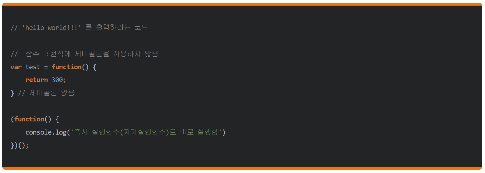

# JavaScript Memo

* ## 목차
    * Js 기본 함수
    * 즉시 실행 함수

---
## Js 기본 함수

> e.stopPropagation()

부모태그로의 이벤트 전파를 중지하라는 의미

---
## 즉시 실행 함수

> 즉시 실행 함수란?

함수를 정의하자마자 바로 호출하는 함수

> 기본형
```javascript
(function(){
    //
})()
```
> 기명 즉시 실행 함수
```javascript
(function square(x){
    // 2 를 인자로 받아온다.
    console.log(x*x);
    // 4
})(2);
```
> 익명 즉시 실행 함수
```javascript
(function(x){
    console.log(x*x);
})(2);
```
> 변수에 즉시 실행 함수 저장
```javascript
(mySquare = function(x){
    console.log(x*x);
})(2);
// 4
mySquare(3);
// 9
```
> Tip

라이브러리 전역 변수의 충돌을 막을수 있다. 예를 들어 jQuery 나 Prototype 라이브러리는 동시에 $ 라는 전역 변수를 사용한다. 만약, 이 두개의 라이브러리를 같이 사용한다면 $ 변수 충돌이 생기게 된다. 이러한 상황을 아래와 같이 즉시 실행 함수를 사용하여 $ 전역 변수의 충돌을 피할 수 있다.
```javascript
(function ($) {
    // $ 는 jQuery object
})(jQuery);
```
> 즉시 실행 함수 앞에 세미 콜론 붙이는 이유

아래와 같이 앞에 세미콜론이 없을 경우 오류가 발생하기 때문에 관습처럼 붙인다.



---