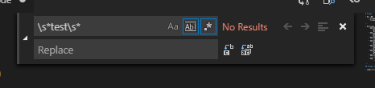

# VsCode

* ## 목록
    * VsCode ShortCut
    * VsCode Tip

---

* ## VsCode ShortCut
    * ### 셀렉션 축소 확장
        * Mac : `ctrl + shift + cmd + left` or `ctrl + shift + cmd + right`
        * Windows : `shift + alt + left` or `shift + alt + right`
    * ### 다중 커서 셀렉션
        * Mac : `opt + cmd + up` or `opt + cmd + down`
        * Windows : `ctrl + alt + up` or `ctrl + alt + down`
    * ### 컬럼(박스) 셀렉션
        * 커서를 원하는 곳에 위치 시켜놓고 `shift + alt 를 누른채로 드래그` 
    * ### 셀렉션 위/아래로 복사
        * Mac : `opt + shift + up` or `opt + shift + down`
        * Windows : `shift + alt + down` or `shift + alt + up`
    * ### 셀렉션 위/아래로 이동
        * Mac : `opt + up` or `opt + down`
        * Windows : `alt + up` or `alt + down`
    * ### 셀렉션 되돌리기
        * Mac : `cmd + u`
        * Windows : `ctrl + u`
    * ### 심볼 이름 변경
        * 변경하고 싶은 심볼을 선택후 `F2`
    * ### 모든 심볼 찾기
        * `shift + F12`
    
---

## VsCode Tip

> 정규식으로 단어 찾아서 전부 지우기

아래 그림처럼 정규식 사용 체크해주고 정규식으로 검출해서 특정 단어를 지울수 있다.

이걸 이용하면 test class 만들고 필요할때 삭제해서 넘겨줘도 괜찮을거 같다.

