# Vue-element-admin Memo

* ## 목차
    * sidebar
    * icon
    * element-ui table
        * element-ui 의 table 간략 사용법
        * table 선택 후 삭제
    * build

---

## sidebar

> sidebar 사용법

layout/sidebar/index.vue 에서 permission_routes 의 object 를 for 문을 돌려서 메뉴를 만든것을 볼 수 있다. 여기서 permission_routes 는 store 에 정의 되어 있는데...

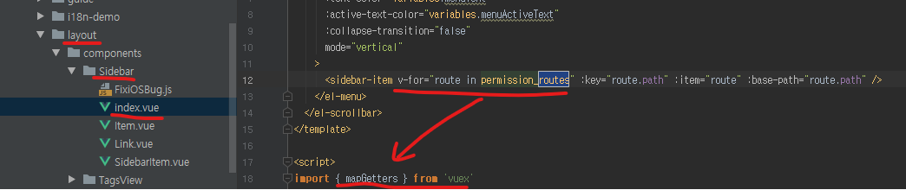

store/index.vue 에 가보면 getters 라는 오브젝트가 보인다.

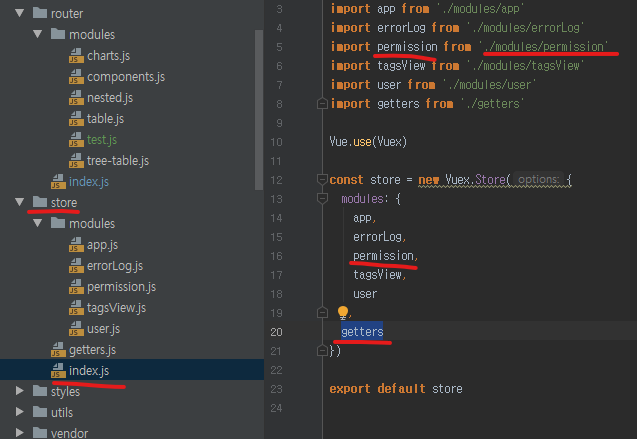

이 오브젝트안에는 permission_routes 가 들어있는데 위와 아래의 이미지를 참고하여 보면  permission.routes 라는 것을 알 수 있고, 

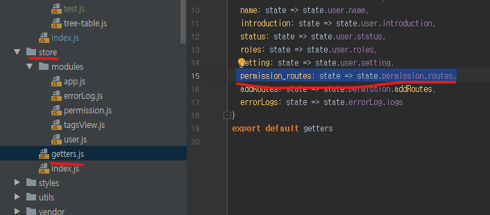

이 permission.routes 는 배열로 GenerateRoutes 라는 action 이 호출되었을때 생성된다는 것을 알 수 있고, (GenerateRoutes 가 언제 호출되는지는 이 내용과는 관계 없음으로 확인해보지 않았다.) 이 action 이 실행될때, asyncRoutes(accessedRoutes) 안에 담긴 내용은 설정해놓은 권한을 확인후 constantRoutes 와 합쳐져서 routes 에 담긴다는 것을 알 수 있다. 

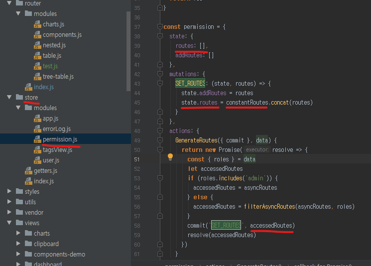

asyncRoutes 와 constantRoutes 는 router/index.js 에 명시 되어 있으며 권한을 설정하지 않을 거라면 constantRoutes 에 routes 내용을 명시해 주면 그 내용을 토대로 sidebar 가 생성된다는 것을 알 수 있다.

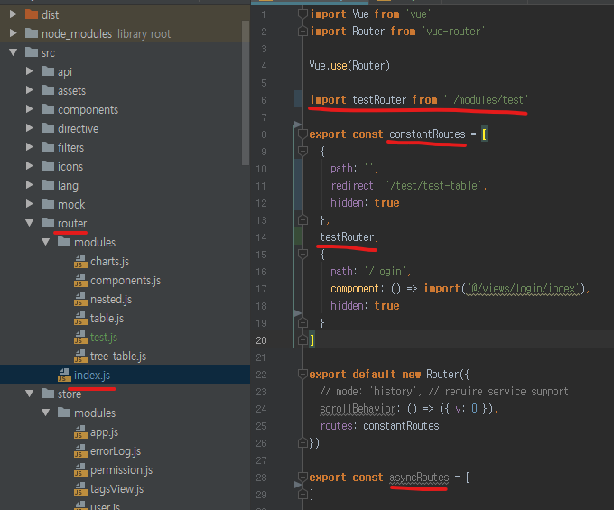

## icon

> sidebar icon 사용법

router 

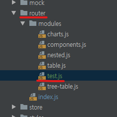

## element-ui table

> element-ui 의 table 간략 사용법

기본적으로 el-table 에 list binding 시켜서 (ex. :data="list") table 을 만드는 방식이다.
list 는 기본적으로 [{...}, {...}] 이러한 형태이다. 그리고 el-table-column 의 prop 값이 column 을 결정짓고 prop 값을 주지 않을 거라면 아래 slot 을 이용한 custom 값을 줄수도 있다.

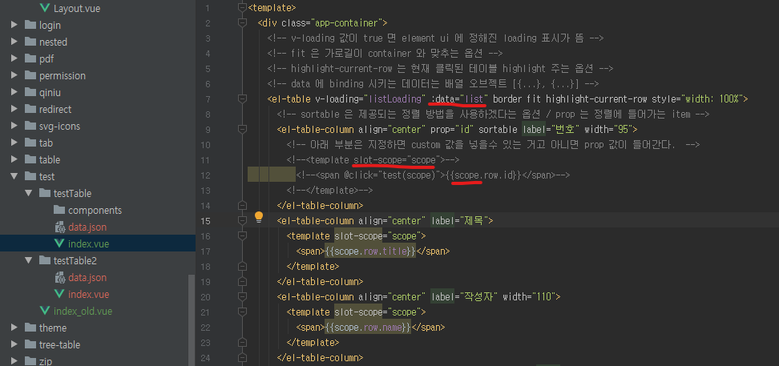

custom 값을 줄때 slot-scope 의 값은 꼭 scope 일 필요는 없고 위의 이미지에 빨간줄 쳐진 (scope) 부분만 일치시켜주면 된다. 

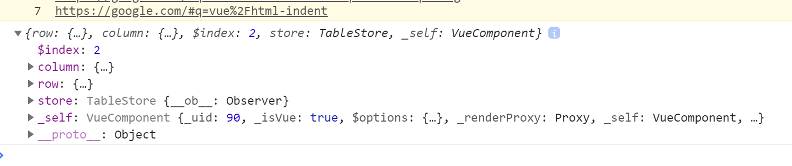

참고용으로 scope 의 object 를 console 로 출력해본 화면이다.

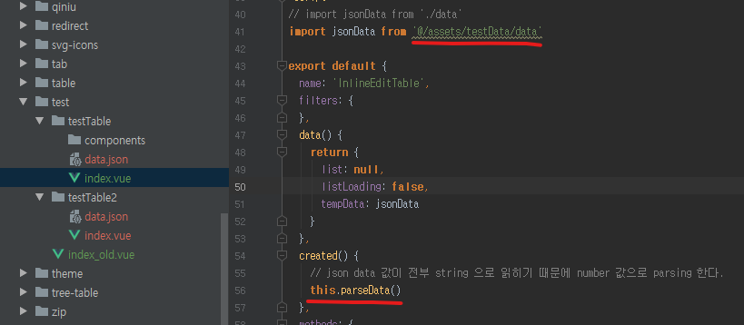

json 데이타 값은 받아왔을때 전부 string type 이기 때문에 정렬을 위해선 data 의 type 을 바꾸는 parsing 이 필요하다. 그래서 component 가 생성될때 함수를 호출해 data 를 parsing 해주도록 하였다.

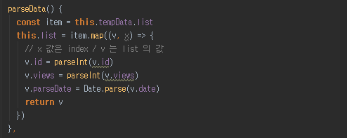

파싱함수의 모습은 위의 그림과 같다. date 값은 파싱하면 사람이 날짜를 구분하기 힘든 숫자 값이 나오기 때문에 parseData 란 변수를 만들어서 담았다.

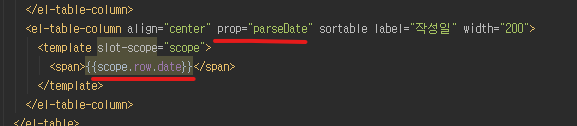

파싱된 date 는 사람이 정확한 날짜를 알아보기 힘들기 때문에 정렬 방식에 쓰는 데이타는 parseDate 로 사용하였구, table 에 찍히는 custom data 는 기존의 object 안에 date 값을 사용하였다.

> table 선택 후 삭제

아래와 같이 테이블에 select box 를 만들어서 버튼을 눌렀을때 삭제 하는 방법이다.

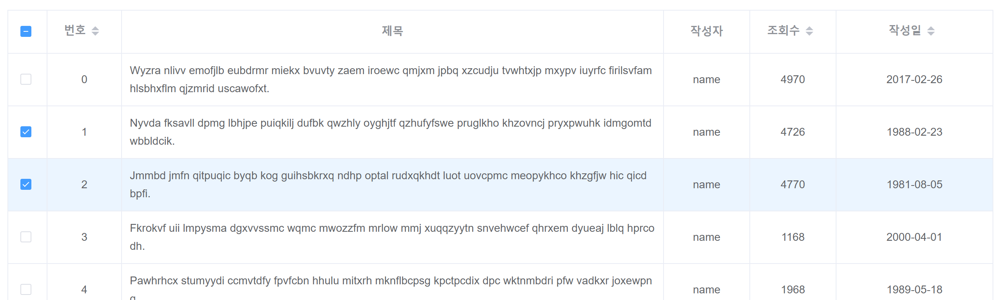

우선 element-ui 에서 제공하는 select box 와 select box 를 눌렀을때 함수를 호출해주는 방식을 사용하려면 아래의 그림과 같이 table 에는 selection-change 라는 이벤트를 만들고 type 이 selection 이라는 column 을 만들면 된다.

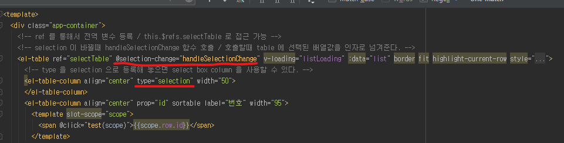

selection event 에선 선택된 값을 변수에 저장 시켜주기만 하였다.
val 로는 체크한 값 전체가 array 로 넘어온다.

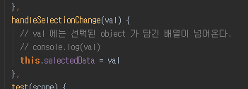

버튼을 눌렀을때 함수를 호출하여 selectedData 에 저장된 배열과 현재 테이블에 뿌려주는 list 와 비교하여 id 값이 같을때 object 를 지워주는 방식을 사용하여 테이블의 삭제를 진행하였다. 나름의 최적화를 위해서 맞는 id 값이 있을때 selectedData 의 배열도 같이 지우도록 하였다.

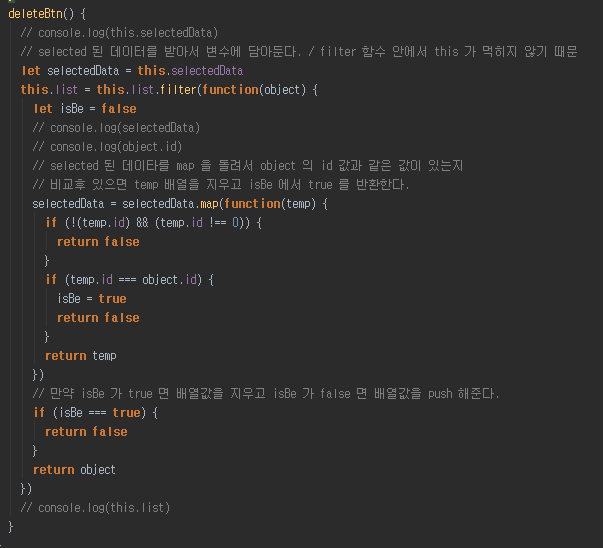

> 동적 테이블 할당을 위한 key array 만드는 방법

~~~javascript
this.listKeys = Object.keys(this.tempData.list[0])
~~~

> 동적 테이블 만드는 법

element ui 에서 제공하는 table 요소를 사용해 동적 테이블을 구성하기 위해선 data 를 담고 있는 object list 와 각 object 의 key 값의 option 을 담을 object list 가 필요하다

~~~javascript
// 예제
dataArray = [
    {
        id: 1,
        name: 'keke',
        date: '2019-01-23'
    },
    {
        id: 2,
        name: 'haha',
        date: '2019-02-01'
    }
    ...
]

optionArray = [
    {
        attr: 'id',
        align: 'center',
        width: '200',
        isShow: true
    },
    {
        attr: 'name',
        align: 'left',
        width: '100',
        isShow: true
    }
    ...
]
~~~

위와 같은 object 두개를 바탕으로 동적 테이블을 구성하려면 아래의 그림과 같이 데이터를 바인딩 해주면 된다. 

우선 기본적으로 table 에 dataArray 를 binding 해주면 이 값을 바탕으로 테이블을 구성한다.

그리고 다음으로 option 을 for 문으로 돌려서 table 의 정렬 규칙을 만들어 주면 된다. 예를 들어 id 값을 보여주기 싫다면 isShow = false 값을 넣고, v-if 에 false 값이 입력되어 column 요소가 출력이 안되게 하면 된다.

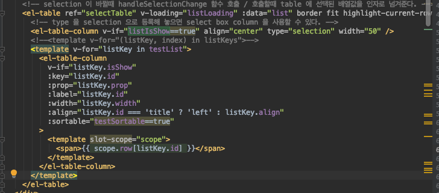

data 를 서버에서 받아올때마다 settingKey 라는 함수가 호출되도록 하고, settingKey 라는 함수에서 optionArray 의 값을 조작해 주면 된다.

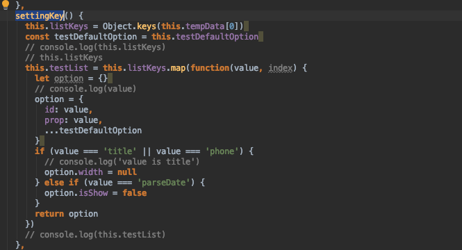

아래 그림과 같이 testDefaultOption 에 기본 설정값을 구성하고 오버라이딩 하는 방식으로 데이타를 바꿔준다.

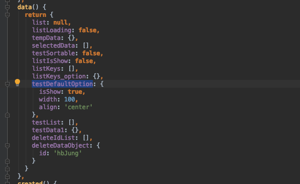

---

## Axios 기본

<!-- rest api 형식이라면 주소가 아래와 같은 형식으로 만들어 진다.

~~~javascript
let id = 'keke'
let key = '1'

const url_list = `http://example.com/table/list/${key}/keyword`
const url_delete = `http://example.com/table/list/${key}/keyword/${id}/delete`
~~~ -->

페이지가 만들어 질때, 서버에서 데이타를 받아온다. async function 을 사용하기 위해선 promise 타입을 리턴해줘야 한다. 저 뒤에 then 과 catch 를 붙이면 undefined 값으로 동작되니 주의!

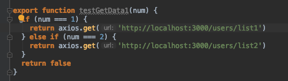

데이타를 받아오면서 optionArray 를 세팅해주고, 세팅이 끝나면 dataArray 를 세팅해준다.

하지만 일련의 동작이 데이타를 받은 시점에서 순차적으로 진행되기를 원하기 때문에 async function 을 사용해서 아래 함수의 동작은 동기 처리 시켰다.

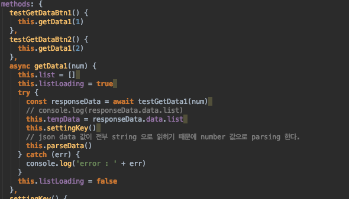

데이터를 지워줄때는 get 방식으로 파라미터에 담고 가도 되지만, id 값과 password 등 중요한 값을 담고 갈수도 있기 때문에 post 방식으로 body 에 담아 간다. 아래 그림의 list 에 담아 가는 값은 아래와 같이 id 값과 지울 table 의 index 값을 담은 array object 이다.
~~~javascript
{ 
    id: 'hbJung',
    list: [ 0, 1 ] 
}
~~~

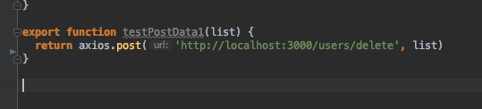

아래의 그림은 post 지울 내용을 post 로 넘겨주고 서버에서 success 신호를 날려주었을때 list 를 지워주는 동작이다.

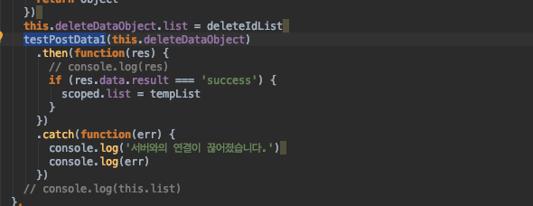

---

## Build

> build 시 assets 의 파일 변환 관련

기본적으로 외부 파일은 @/src/assets 넣어서 사용한다.
build 시 webpack.prod.conf.js 의 설정 내용에 따라 /dist/js/chunk-[hash값]으로 변환된다.

---

## etc

> state attr 변경법

sortable 이라는 attr 을 제어하고 싶다면 sortable 에 bind 시키고 true, flase 값을 변수로 주면 제어 가능해 진다.

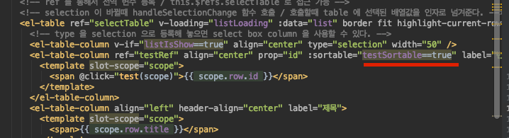

